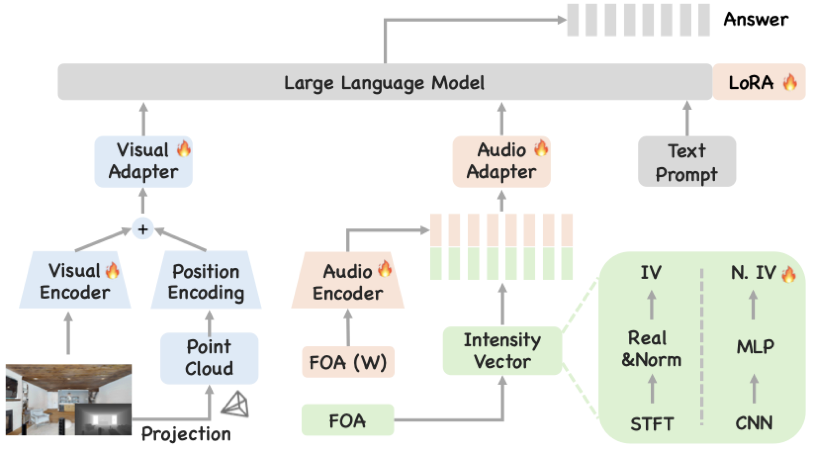
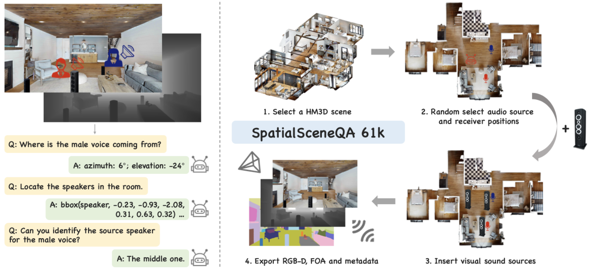

# JAEGER: Joint 3D Audio-Visual Grounding and Reasoning in Simulated Physical Environments

<div align="center">

<b>3D AV-LLM leveraging RGB-D and First-Order Ambisonics for end-to-end grounding and spatial reasoning</b>

<div>
    <a href="https://arxiv.org/abs/2602.18527" target="_blank">
      
    </a>
    <a href="https://github.com/liuzhan22/JAEGER" target="_blank">
      
    </a>
    <a href="https://huggingface.co/tsinghua-ee/JAEGER/tree/main/datasets" target="_blank">
      
    </a>
    <a href="https://huggingface.co/tsinghua-ee/JAEGER/tree/main/checkpoints" target="_blank">
      
    </a>
    
</div>

</div>

---

## 📖 Abstract

We present **JAEGER**, a framework that extends audio-visual LLMs from 2D to 3D space through joint **RGB-D** observations and **multi-channel first-order ambisonics (FOA)**, enabling reliable source localization and spatial reasoning in complex 3D environments. At its core is the **Neural Intensity Vector (Neural IV)**, a learned spatial audio representation that produces robust directional cues even under reverberation and overlapping sources. We further release **SpatialSceneQA**, a 61k-sample benchmark with degree-level azimuth/elevation supervision for direction-of-arrival estimation, 3D box grounding, and multi-speaker matching.

<div align="center">
  
  <br>
  <em>Overview of the JAEGER framework.</em>
</div>

---

## 📦 SpatialSceneQA Dataset

A 61k-sample spatial audio-visual benchmark pairing RGB-D observations with 4-channel first-order ambisonic audio under degree-level 3D supervision. Annotation manifests live under [`data/`](./data); the JSON format follows [`data/example_data.json`](./data/example_data.json).

<div align="center">
  
  <br>
  <em>Data construction pipeline of SpatialSceneQA.</em>
</div>

---

## 🛠️ Installation

```bash
conda env create -f environments.yml
conda activate vsm2
```

Then download [Qwen2.5-Omni-7B](https://huggingface.co/Qwen/Qwen2.5-Omni-7B) and set `model.qwen_path` in [`configs/config.yaml`](./configs/config.yaml).

---

## 🚀 Quick Start

### Data Preparation

Download the RIRs from [SpatialSceneQA](https://huggingface.co/tsinghua-ee/JAEGER/tree/main/datasets/SpatialSceneQA), then convolve them with dry monaural speech from [LibriSpeech](https://www.openslr.org/12) using [`data/data_tools/conv_ir_speaker_foa.py`](./data/data_tools/conv_ir_speaker_foa.py). For the train, validation, and test splits, we use `train-clean-100`, `dev-clean`, and `test-clean`, respectively.

### Training

Prepare annotations following [`data/example_data.json`](./data/example_data.json), edit paths in [`configs/config.yaml`](./configs/config.yaml), and launch on **3 nodes × 8 × A100** (run on each node with `i ∈ {0, 1, 2}`):

```bash
accelerate launch --config_file deepspeed/3_8A100.yaml --machine_rank i \
    trainer_hf.py --cfg-path configs/config.yaml
```

### Inference

Each task script launches 8-way data-parallel inference followed by a `merge_*.py` step. Edit the `PY_SCRIPT` / `CFG_PATH` / `OUTPUT_DIR` placeholders inside each `.sh`, then run:

```bash
# Audio-only (FOA): DoA estimation & 3D source grounding
bash inference/audio-only/infer_audio.sh && python inference/audio-only/merge_audio_files.py

# Audio-visual (RGB-D + FOA): joint spatial grounding & reasoning
bash inference/audio-visual/inference_av.sh && python inference/audio-visual/merge_av_files.py

# Visual-only (RGB-D): visual speaker grounding
bash inference/visual-only/inference_visual.sh && python inference/visual-only/merge_visual_files.py
```

Decoding hyperparameters live in [`configs/decode_config.yaml`](./configs/decode_config.yaml).

---

## 📝 Citation

```bibtex
@inproceedings{liu2026jaeger,
  title={JAEGER: Joint 3D Audio-Visual Grounding and Reasoning in Simulated Physical Environments},
  author={Liu, Zhan and Tang, Changli and Wang, Yuxin and Zhu, Zhiyuan and Chen, Youjun and Shao, Yiwen and Wang, Tianzi and Ke, Lei and Jin, Zengrui and Zhang, Chao},
  booktitle={Proc. ICML},
  year={2026}
}
```

---
*License: Apache 2.0*
